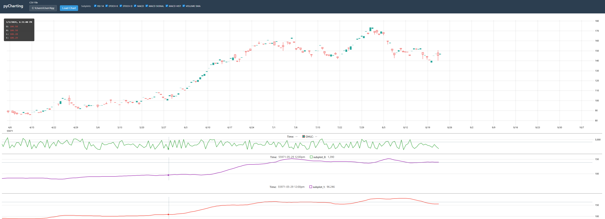

# Financial Charting Library

[](https://badge.fury.io/py/pycharting)
[](https://pypi.org/project/pycharting/)
[](https://opensource.org/licenses/MIT)
[](https://pepy.tech/project/pycharting)
[](https://github.com/psf/black)

A high-performance, open-source Python charting library for visualizing OHLC (Open, High, Low, Close) financial data with technical indicators. Built with FastAPI, uPlot, and modern web technologies.



## Table of Contents

- [Installation](#installation)
- [Quick Start](#quick-start)
- [Library Architecture](#library-architecture)
- [Data Flow Examples](#data-flow-examples)
- [API Reference](#api-reference)
- [Indicators](#indicators)
- [Frontend Features](#frontend-features)
- [Development](#development)
- [Contributing](#contributing)
- [License](#license)

## Installation

**From PyPI (Recommended):**

```bash
pip install pycharting
```

**From Source:**

```bash
# Clone the repository
git clone https://github.com/alihaskar/pycharting.git
cd pycharting

# Install with Poetry
poetry install
```

## Quick Start

### Features

- **High Performance**: Render 500k+ data points at 60fps
- **Fast Loading**: Parse and display 100MB CSV files in under 2 seconds
- **Interactive**: Smooth zoom and pan with <16ms latency
- **Technical Indicators**: RSI, SMA, EMA, MACD, Bollinger Bands, Stochastic, and more
- **Multiple Chart Panels**: Synchronized main chart with unlimited subplots
- **Flexible Data Input**: Accept CSV files or Pandas DataFrames
- **Custom Indicators**: Easy to add your own calculated indicators
- **Web-Based**: Beautiful interactive charts in your browser
- **Local Processing**: All data stays on your machine

### Basic Usage

#### Python API (Recommended)

```python
import pandas as pd
import charting

# Load from CSV file
charting.plot("data/sample.csv")

# Or use a DataFrame directly
df = pd.read_csv("data/sample.csv")
df['timestamp'] = pd.to_datetime(df['timestamp'])
df.set_index('timestamp', inplace=True)

# Add indicators as columns (optional)
df['sma_20'] = df['close'].rolling(20).mean()
df['rsi_14'] = calculate_rsi(df['close'], 14)

# Plot with overlays and subplots
charting.plot(
    df,
    overlays=['sma_20'],    # Indicators on main chart
    subplots=['rsi_14']     # Indicators in separate panels
)
```

#### Command Line

```bash
# Start the server
poetry run python run.py

# Or load data immediately
poetry run python run.py data/sample.csv
```

The browser will open automatically at `http://localhost:8000`.

### Example Script

See `examples/simple_plot.py` for a complete example with multiple indicators:

```bash
poetry run python examples/simple_plot.py
```

---

## Library Architecture

### Overview

```
┌─────────────────────────────────────────────────────────────┐
│                     User Interface                          │
│  ┌─────────────┐  ┌──────────────┐  ┌──────────────────┐  │
│  │ Python API  │  │  Web Browser  │  │  Command Line   │  │
│  │charting.plot│  │  (index.html) │  │    (run.py)     │  │
│  └──────┬──────┘  └───────┬───────┘  └────────┬─────────┘  │
└─────────┼──────────────────┼───────────────────┼────────────┘
          │                  │                   │
          └──────────────────┼───────────────────┘
                             │
                    ┌────────▼─────────┐
                    │   FastAPI Server  │
                    │   (src/api/)      │
                    │  - main.py        │
                    │  - routes.py      │
                    │  - processor.py   │
                    └────────┬──────────┘
                             │
          ┌──────────────────┼──────────────────┐
          │                  │                  │
    ┌─────▼──────┐    ┌─────▼──────┐    ┌─────▼──────┐
    │ Ingestion  │    │ Processing │    │  Frontend  │
    │ (loader)   │    │(indicators)│    │  (uPlot)   │
    │  - CSV     │    │  - RSI     │    │  - charts  │
    │  - Schema  │    │  - SMA/EMA │    │  - dividers│
    │  - Detect  │    │  - MACD    │    │  - sync    │
    └────────────┘    └────────────┘    └────────────┘
```

### Component Wiring

#### 1. **Data Ingestion Layer** (`src/charting/ingestion/`)

**Purpose**: Load and validate CSV data

- **`loader.py`**: CSV file reading with automatic column detection
- **`schema.py`**: Data validation and schema enforcement
- **`detector.py`**: Auto-detect column names (open/high/low/close/volume)
- **`mapper.py`**: Map non-standard column names to expected format

**Flow**:
```
CSV File → loader.py → detector.py → mapper.py → Validated DataFrame
```

#### 2. **Processing Layer** (`src/charting/processing/`)

**Purpose**: Calculate technical indicators and resample data

- **`indicators.py`**: Technical indicators (RSI, SMA, EMA, Bollinger Bands, MACD, Stochastic)
- **`resampler.py`**: Timeframe conversion (1min → 5min, 15min, 1h, etc.)
- **`pivot.py`**: Data transformation for efficient rendering

**Flow**:
```
DataFrame → indicators.py → Indicator Columns
DataFrame → resampler.py → Resampled OHLC
```

#### 3. **API Layer** (`src/charting/api/`)

**Purpose**: HTTP server and request handling

- **`main.py`**: FastAPI application, CORS, static file serving
- **`routes.py`**: API endpoints (`/chart-data`, `/health`)
- **`processor.py`**: Request processing, data loading, indicator calculation
- **`models.py`**: Pydantic models for request/response validation

**Endpoints**:
```
GET /chart-data?filename=X&overlays=Y&subplots=Z
GET /health
GET / (serves frontend)
```

**Flow**:
```
HTTP Request → routes.py → processor.py → ingestion + processing → JSON Response
```

#### 4. **Python API** (`src/charting/`)

**Purpose**: High-level Python interface

- **`charting.py`**: Main `Charting` class for loading and displaying data
- **`server.py`**: Server lifecycle management (start/stop)
- **`browser.py`**: Automatic browser launching
- **`launcher.py`**: Process management for server
- **`transformer.py`**: DataFrame to API format conversion
- **`__init__.py`**: Public API exports (`plot()` function)

**Flow**:
```python
charting.plot(df) 
  → Charting.load()
    → server.start()
    → transformer.to_csv()
    → browser.open(url)
```

#### 5. **Frontend** (`src/charting/frontend/`)

**Purpose**: Interactive web-based visualization

- **`index.html`**: Main HTML structure, controls, layout
- **`app.js`**: Application state, event handlers, indicator controls
- **`multi-chart.js`**: Multiple synchronized uPlot charts (main + subplots)
- **`chart.js`**: Single chart wrapper (legacy)
- **`divider.js`**: Draggable dividers for resizing panels
- **`data-client.js`**: API communication layer

**Flow**:
```
index.html loads
  → app.js initializes
    → multi-chart.js creates charts
      → data-client.js fetches data
        → uPlot renders charts
          → divider.js enables resizing
```

---

## Data Flow Examples

### Example 1: Loading CSV via Python API

```python
charting.plot("data/sample.csv", overlays=['sma_20'], subplots=['rsi_14'])
```

**Step-by-step**:
1. `charting.plot()` → calls `Charting().load()`
2. `Charting.load()` validates DataFrame or reads CSV
3. `server.start()` launches FastAPI on available port
4. `transformer.to_csv()` saves DataFrame to temp file
5. `browser.open()` opens URL with query params: `?filename=X&overlays=sma_20&subplots=rsi_14`
6. Browser loads `index.html` from FastAPI static files
7. `app.js` parses URL params and calls `chartManager.loadAndRender()`
8. `multi-chart.js` fetches data via `/chart-data` endpoint
9. `routes.py` → `processor.py` loads CSV, calculates indicators
10. JSON data returned to frontend
11. `multi-chart.js` creates uPlot instances (main chart + subplots)
12. `divider.js` creates draggable dividers between charts
13. Charts synchronized for zoom/pan

### Example 2: Loading CSV via Web Interface

```
User enters "sample.csv" and clicks "Load Chart"
```

**Step-by-step**:
1. User types filename in input field
2. `app.js` event handler captures click
3. `app.loadChart()` → `chartManager.loadAndRender(filename)`
4. `data-client.js` constructs API URL: `/chart-data?filename=sample.csv`
5. FastAPI receives request in `routes.py`
6. `processor.process_chart_request()` validates filename
7. `loader.py` reads CSV from `data/` directory
8. `detector.py` auto-detects column names
9. `indicators.py` calculates any requested indicators
10. `processor.py` formats data as uPlot-compatible JSON
11. Response sent back to browser
12. `multi-chart.js` renders charts
13. `app.buildIndicatorControls()` creates checkboxes for toggling indicators

### Example 3: Adding Indicators Dynamically

```
User checks "RSI 14" checkbox
```

**Step-by-step**:
1. Checkbox change event captured by `app.js`
2. `chartManager.toggleSubplot('rsi_14')` called
3. Updates `visibleSubplots` set
4. Updates `config.subplots` array
5. Calls `multi-chart.initialize()` to re-render
6. Fetches data with new subplot: `/chart-data?subplots=rsi_14`
7. `processor.py` calculates RSI if not in CSV
8. Returns data with RSI column
9. `multi-chart.js` creates new subplot panel
10. `divider.js` adds divider above new subplot
11. All charts re-synchronized

---

## API Reference

### Python API

#### `charting.plot(data, **kwargs)`

Plot financial data with a single command.

**Parameters**:
- `data` (DataFrame | str): DataFrame with OHLC data or path to CSV file
- `overlays` (list[str], optional): Indicators to plot on main chart (e.g., `['sma_20', 'ema_12']`)
- `subplots` (list[str], optional): Indicators to plot in separate panels (e.g., `['rsi_14', 'macd']`)

**Returns**: URL string where chart is served

**Example**:
```python
import charting
charting.plot("data/sample.csv", overlays=['sma_20'], subplots=['rsi_14'])
```

#### `Charting` Class

Advanced usage with more control:

```python
from charting import Charting

chart = Charting()
url = chart.load(df, overlays=['sma_20'], subplots=['rsi_14'])
# Server keeps running...
chart.close()  # Stop server
```

**Methods**:
- `load(df, **kwargs)`: Load data and start server
- `close()`: Stop the server
- `is_running()`: Check if server is running

### HTTP API

#### `GET /chart-data`

Fetch chart data with optional indicators and timeframe resampling.

**Query Parameters**:
- `filename` (required): CSV file name (relative to `data/` directory)
- `overlays` (optional): Comma-separated indicator names (e.g., `sma_20,ema_12`)
- `subplots` (optional): Comma-separated indicator names (e.g., `rsi_14,macd`)
- `timeframe` (optional): Resample to timeframe (e.g., `5min`, `1h`, `1D`)

**Response**:
```json
{
  "data": [
    [1609459200000, 1609459260000, ...],  // timestamps
    [100.0, 101.0, ...],                   // open
    [102.0, 103.0, ...],                   // high
    [99.0, 100.5, ...],                    // low
    [101.0, 102.0, ...],                   // close
    [1000, 1500, ...],                     // volume
    [100.5, 101.2, ...],                   // sma_20 (if requested)
    [45.2, 52.1, ...]                      // rsi_14 (if requested)
  ],
  "metadata": {
    "overlays": ["sma_20"],
    "subplots": ["rsi_14"],
    "filename": "sample.csv",
    "timeframe": "1min"
  }
}
```

#### `GET /health`

Health check endpoint.

**Response**:
```json
{
  "status": "ok",
  "version": "0.1.0"
}
```

---

## Indicators

### Available Indicators

#### Overlay Indicators (on main chart)
- **SMA** - Simple Moving Average
  - `sma_10`, `sma_20`, `sma_50`, `sma_200`
- **EMA** - Exponential Moving Average
  - `ema_9`, `ema_12`, `ema_21`, `ema_26`
- **Bollinger Bands**
  - `bb_upper`, `bb_middle`, `bb_lower`

#### Subplot Indicators (separate panels)
- **RSI** - Relative Strength Index
  - `rsi_14` (default period: 14)
- **MACD** - Moving Average Convergence Divergence
  - `macd`, `macd_signal`, `macd_hist`
- **Stochastic Oscillator**
  - `stoch_k`, `stoch_d`
- **Volume SMA**
  - `volume_sma` (volume with 20-period SMA overlay)

### Adding Custom Indicators

To add indicators to your data:

```python
import pandas as pd

# Load data
df = pd.read_csv("data/sample.csv")
df['timestamp'] = pd.to_datetime(df['timestamp'])
df.set_index('timestamp', inplace=True)

# Calculate indicators
df['sma_20'] = df['close'].rolling(window=20).mean()
df['ema_12'] = df['close'].ewm(span=12, adjust=False).mean()

# Calculate RSI
def calculate_rsi(series, period=14):
    delta = series.diff()
    gain = (delta.where(delta > 0, 0)).rolling(window=period).mean()
    loss = (-delta.where(delta < 0, 0)).rolling(window=period).mean()
    rs = gain / loss
    return 100 - (100 / (1 + rs))

df['rsi_14'] = calculate_rsi(df['close'], 14)

# Plot with indicators
import charting
charting.plot(df, overlays=['sma_20', 'ema_12'], subplots=['rsi_14'])
```

---

## Frontend Features

### Interactive Controls

1. **Indicator Toggles**: Check/uncheck indicators to show/hide them
2. **Draggable Dividers**: Resize chart panels by dragging horizontal dividers
3. **Synchronized Zoom**: Zoom/pan on any chart affects all charts
4. **Synchronized Crosshair**: Hover cursor synchronized across all panels
5. **Timeframe Selection**: Resample data to different timeframes
6. **Scrollable Layout**: Page scrolls when you have many indicators

### Keyboard Shortcuts

- **Scroll**: Zoom in/out
- **Click + Drag**: Pan chart
- **Hover**: Show crosshair with values

---

## Project Structure

```
charting/
├── src/
│   └── charting/                  # Main package
│       ├── __init__.py            # Public API (plot function)
│       ├── charting.py            # Charting class
│       ├── server.py              # Server management
│       ├── browser.py             # Browser launcher
│       ├── launcher.py            # Process management
│       ├── transformer.py         # Data transformation
│       ├── detector.py            # Column detection
│       ├── mapper.py              # Column mapping
│       │
│       ├── api/                   # FastAPI backend
│       │   ├── main.py            # App entry, static serving
│       │   ├── routes.py          # API endpoints
│       │   ├── processor.py       # Request processing
│       │   ├── models.py          # Pydantic models
│       │   └── exceptions.py      # Custom exceptions
│       │
│       ├── ingestion/             # Data loading
│       │   ├── loader.py          # CSV reader
│       │   └── schema.py          # Validation
│       │
│       ├── processing/            # Data processing
│       │   ├── indicators.py      # Technical indicators
│       │   ├── resampler.py       # Timeframe conversion
│       │   └── pivot.py           # Data transformation
│       │
│       └── frontend/              # Web UI
│           ├── index.html         # Main page
│           ├── app.js             # Application logic
│           ├── multi-chart.js     # Multi-chart manager
│           ├── chart.js           # Single chart (legacy)
│           ├── divider.js         # Resizable dividers
│           ├── divider.css        # Divider styles
│           ├── data-client.js     # API client
│           ├── layout-manager.js  # Layout utilities
│           └── ...
│
├── examples/
│   ├── simple_plot.py             # Basic usage example
│   └── demo_all_features.py       # Advanced example
│
├── data/                          # Sample CSV files
│   ├── sample.csv                 # Moderate volatility
│   ├── crypto.csv                 # High volatility
│   └── stock.csv                  # Low volatility
│
├── tests/                         # Test suite
│   ├── test_api_*.py              # API tests
│   ├── test_indicators_*.py       # Indicator tests
│   ├── test_frontend_*.py         # Frontend tests
│   └── ...
│
├── pyproject.toml                 # Poetry config
├── README.md                      # This file
└── run.py                         # CLI launcher
```

---

## Development

### Running Tests

```bash
# Run all tests
poetry run pytest

# Run specific test file
poetry run pytest tests/test_indicators.py

# Run with coverage
poetry run pytest --cov=src --cov-report=html

# Run only fast tests (skip integration)
poetry run pytest -m "not integration"
```

### Code Quality

```bash
# Format code
poetry run black src tests

# Check types
poetry run mypy src

# Lint
poetry run ruff check src tests
```

### Adding Dependencies

```bash
# Production dependency
poetry add package-name

# Development dependency
poetry add --group dev package-name
```

---

## Configuration

### Server Configuration

The server automatically:
- Finds an available port (starts at 8000, increments if busy)
- Enables CORS for local development
- Serves static files from `src/charting/frontend/`
- Handles graceful shutdown

### Data Requirements

CSV files must have:
- **Required columns**: timestamp, open, high, low, close
- **Optional columns**: volume, any indicator columns
- **Timestamp format**: ISO8601, Unix timestamp, or parseable date string

**Example CSV**:
```csv
timestamp,open,high,low,close,volume
2024-01-01 00:00:00,100.0,102.0,99.0,101.0,1000
2024-01-01 00:01:00,101.0,103.0,100.5,102.0,1500
```

---

## Performance

### Benchmarks

- **Render**: 500k+ points at 60fps
- **Load**: 100MB CSV in <2 seconds
- **Interaction**: <16ms zoom/pan latency
- **Memory**: Efficient columnar data storage

### Optimization Tips

1. **Use appropriate timeframes**: Higher timeframes = less data = faster rendering
2. **Limit indicators**: Each indicator adds a render pass
3. **CSV optimization**: Pre-calculate indicators and save to CSV
4. **Batch operations**: Load multiple indicators at once instead of one-by-one

---

## Troubleshooting

### Common Issues

**"Failed to load chart"**
- Ensure CSV file exists in `data/` directory
- Check CSV format (must have OHLC columns)
- Verify server is running (`http://localhost:8000/health`)

**"Module not found"**
- Run `poetry install` to install dependencies
- Ensure you're using `poetry run python` or `poetry shell`

**"Port already in use"**
- Server auto-increments to find available port
- Check terminal output for actual port number
- Or manually kill process: `lsof -ti:8000 | xargs kill -9`

**Charts not rendering**
- Open browser console (F12) to check for JavaScript errors
- Verify data is being returned: `http://localhost:8000/chart-data?filename=sample.csv`
- Check that uPlot CDN is accessible

**Indicators not showing**
- Ensure indicator data exists in CSV or can be calculated
- Check browser console for errors
- Verify indicator names match expected format (e.g., `rsi_14`, not `RSI-14`)

---

## Additional Resources

### Sample Data

Generate custom sample data:
```bash
poetry run python scripts/generate_sample_data.py \
  --output data/custom.csv \
  --periods 10000 \
  --freq 1min \
  --price 100.0 \
  --volatility 0.02
```

### API Documentation

Interactive API docs available at:
- Swagger UI: `http://localhost:8000/docs`
- ReDoc: `http://localhost:8000/redoc`

---

## License

MIT License - see LICENSE file for details

This is free and open-source software. You are welcome to use, modify, and distribute it under the terms of the MIT License.

---

## Contributing

Contributions are welcome! This is an open-source project.

**How to Contribute:**
1. Fork the repository on GitHub: https://github.com/alihaskar/pycharting
2. Create a feature branch (`git checkout -b feature/amazing-feature`)
3. Make your changes and add tests
4. Ensure all tests pass (`poetry run pytest`)
5. Commit your changes (`git commit -m 'Add amazing feature'`)
6. Push to your branch (`git push origin feature/amazing-feature`)
7. Open a Pull Request

**Areas for Contribution:**
- New technical indicators
- Performance improvements
- Bug fixes
- Documentation improvements
- Additional chart types
- UI/UX enhancements

---

## Support

For issues, questions, or suggestions:
- **GitHub Issues**: https://github.com/alihaskar/pycharting/issues
- **Discussions**: https://github.com/alihaskar/pycharting/discussions
- Check existing issues for solutions
- Review documentation and examples

---

## Roadmap

Future features and enhancements planned for pyCharting:

### Data Sources
- [ ] **Live Data Integration** - Real-time market data feeds
  - WebSocket support for streaming data
  - Integration with popular data providers (Alpaca, Interactive Brokers, etc.)
  - Auto-refresh charts with live updates

### Trading Features
- [ ] **Position Visualization** - Display trading positions on charts
  - Entry/exit markers
  - Position sizing and P&L display
  - Trade annotations and notes
  
- [ ] **Backtest Results** - Visualize backtesting performance
  - Equity curve overlay
  - Drawdown visualization
  - Trade statistics panel
  - Performance metrics display

### Interaction Enhancements
- [ ] **Time Travel** - Navigate through historical data
  - Timeline slider for moving forward/backward in time
  - Replay mode for backtesting analysis
  - Step-by-step trade execution review
  - Date range picker with quick filters

### Additional Indicators
- [ ] Volume profile
- [ ] Order flow imbalance
- [ ] Custom indicator builder
- [ ] More technical indicators (ATR, ADX, Ichimoku, etc.)

### Performance
- [ ] WebGL rendering for even larger datasets
- [ ] Data streaming and lazy loading
- [ ] Enhanced caching mechanisms

Have a feature request? [Open an issue](https://github.com/alihaskar/pycharting/issues) on GitHub!

---

## Links

- **PyPI Package**: https://pypi.org/project/pycharting/
- **GitHub Repository**: https://github.com/alihaskar/pycharting
- **Documentation**: See this README and inline code documentation

---

Built using FastAPI, uPlot, and Python
---
Built with ❤️ from Dubai 